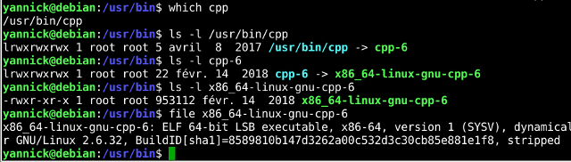
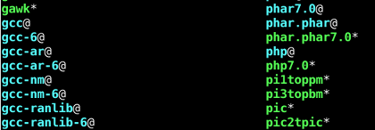

# Le compilateur

## Sous Linux

### Noms connus pour invoquer le compilateur

Parmi les noms connus pour invoquer le compilateur, on trouve :
**cpp**, **g++**, **gcc**, **gcc-x**, **c++**, **cpp-x** (x est le numéro de version du compilateur). 

Mais le véritable nom du compilateur est **gcc**. En principe, s'il est installé, cette commande doit répondre pour en particulier donner son numéro de version :

​    gcc --version

Ceci est très important car les prises en charge du langage ne sont pas les mêmes selon la version.

### Commande pour invoquer le compilateur

Comme il est dit précédemment,  le compilateur peut s'invoquer avec la commande **gcc**.

### Obtenir les options de compilation

Les premières options de compilations peuvent être obtenue avec la commande :

    gcc --h

Bien sûr on peut afficher une page de manuel avec la commande :

    man gcc

### Où se trouve le compilateur ?

Tout d'abord, je signale qu'il est possible que vous invoquiez le compilateur par un lien symbolique (comme "**cpp**", c'est à dire que vous n'utilisez pas directement le fichier exécutable).

Par exemple, vous pouvez connaître le dossier d'origine de la commande que vous tapez avec la commande **which**

    which gcc

Ensuite, une fois rendu dans le dossier en question (**cd le_dossier**), vous pouvez vérifier si le fichier **gcc** est un lien ou pas avec la commande **ls -l**

La présence de -> montre qu'il y a présence d'un lien :

    yannick@debian:/usr/bin$ ls -l gcc
    lrwxrwxrwx 1 root root 5 avril  8  2017 gcc -> gcc-6

On voit par exemple sur le listing ci-dessus que **gcc** est un lien qui mène vers **gcc-6**.

Il peut exister de nombreux liens chaînés comme le montrent les commandes ci-dessous :

{width=100%}

Au final, on voit sur l'exemple ci-dessus que le véritable nom du compilateur (le fichier exécutable) est **x86_64-linux-gnu-cpp-6**

**Note : **  on peut afficher la liste des liens dans un dossier avec la commande  :

    ls -F

Les liens seront reconnaissables car alors terminés par le symbole "**@**" :

{width=80%,float=left}

